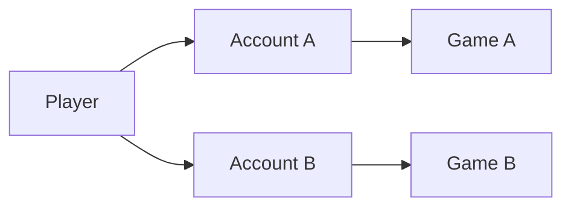
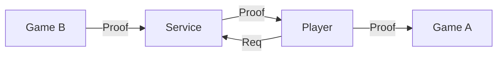
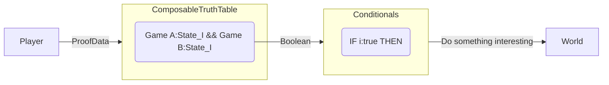
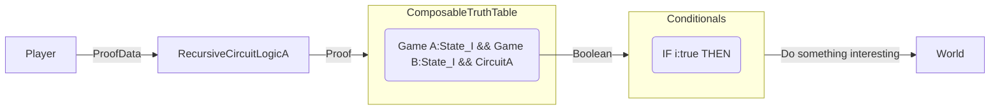

# State Booleans Update Game Secrets

## Introduction

The primary idea here is to use [Storage Proofs](https://www.starknet.io/en/content/what-are-storage-proofs-and-how-can-they-improve-oracles) as our interoperability mechanism. This is useful for two reasons:
1. Storage Proofs encapsulate their state. This allows us to reason about state synchronisation between games using atomic objects.
2. Storage Proofs can be fully asynchronous and agnostic to the transport layer. This allows the player to interact in the transfer (ie. the player may act to partially shield or delay whatever claim is being made).

**Note:** Routing storage proofs to their destination chain through the player is a novel design as far as we know and thus feasability needs to be further explored.

### Boolean Logic 

Reasoning about composability between these game worlds presents its own challenges. We also propose a friendlier developer interface for configuring mods built ontop of this mechanism. We analogize this something as akin to truth tables in boolean logic.

## Overview

---


Imagine we have a player interacting with two games. The player may control two separate accounts on each game. The use of multiple accounts can help to obfuscate actions across the games.

---



Using a 3rd party service they may request a proof of state for Game B. Contrary to current platforms, the service must send the proof directly to the player. The player may then send that proof on to Game A at a time of their choosing.

---



From a developer UX point of view, we can model the configuration of this composable mechanic to be something like the following: 

1. The creation of a truth table which maps some partial product of the game state tables as input values to their respective truth values. 
2. Registered conditionals on that composable table which perform some action in the world.


---



Expressing truth tables over functions of the state is much easier in practice. For this we must add a recursive circuit. This is handy for something like expressing a player is in a certain (x,y) location, has a certain item out of a set of items, etc. Without this our truth table schema ends up looking like a programming language over time as we attempt to add on increasing levels of expressivity.

## Use Cases and Extensions

### Paranoia Device

A paranoia device is a powerful item or ability which _may_ or may not be in the possession of _some_ player. This creates an atmosphere of paranoia during any interaction as the power dynamic and strategy must consider all possibilities.

#### Story

Your are playing a game in a world called the O'Ruggin Trail and want to acquire one of these paranoia devices. You discover there is a way, but it requires you to traverse worlds. You must acquire some item in the native World (O'Ruggin Trail) and also perform some task in the foreign World. Once you acquire these items, players may wonder if you truly have the paranoia device or not. It's certainly more likely! 

However, there is no way for anyone to know (if you've been smart or about your movements in the foreign world) to check if you've completed the task. Since you had requested a proof directly from a 3rd party service, only that single service node would know whether you had completed the task or not. When it comes time for you to use the paranoia device, you submit the proof to the chain along with information relevant to the devices use and surprise your opponents.


### State Transfer Games

State transfer games use the transfer of state through off-chain channels as a central mechanism to obfuscate agent motivations and allegiances.

The following concept may be extended to bots harvesting on N worlds and wealth accumulating across worlds.

#### Story

Imagine you are playing a resource extraction game. Players must create harvester bots to extract resources from the world. Each harvester bot comes with a unique address. As your bot swarm roams across the landscape extracting resources, it accumulates material wealth. This wealth may then be anonymously accumulated into your controller account. Players may or may not be able to see your account balance changing, depending on how it is handled by the game.

Suddenly you encounter a rogue bot. Is it friendly? Is it hostile? The only way to know is to carefully watch its movement. A player in your tenuous alliance says it's not them, but no one else has claimed it. You setup a defense perimeter and declare that any foreign bots, unless given explicit permission, moving beyond the perimeter will be eliminated.

### Nesting Conditional Events

One of the things we may like to establish is a series of boolean expression and conditionals. We may also want to obfuscate this process somehow. Consider the following statement:

```
IF (I hold glue in O'Ruggin Trail && I completed an order in This Cursed Machine) {
    IF (I encounter an enemy && I hold few $BUGS) {
        I get a paranoid device.
    }
}
```

In order to do this, we must augment our current process by emitting encrypted tags for each succesful condition. These tags create a scope for the inner conditional we wish to express next.

### Secret Mappings

Another thing we may want to do is hide the truth tables from players. While universally hiding the truth table remains a difficult problem, selectively hiding the truth tables appears to be practically feasible. Selectively hiding truth tables means whoever creates a truth table must directly share it with friendlies (or simply use it themselves). This presents a problem in that we are giving players the ability to arbitrarily pass whatever downstream conditional exists and do things in the world. That seems either pointless or chaotic. 

The trick we can use to temper this issue is to further constrain the mappings. That is, we set "allowable mappings" or limits on what events may be triggered downstream. You can imagine creating a system where states of a certain rarity are only allowed to be arbitrarily mapped to states of a similar rarity in another game. You cannot map a common state in one game to a rare state in another.

In order to do this, we must augment our current process by using recursive circuits which may verify and constrain our mappings accoring to the digital physics of the world without revealing anything to the chain.

#### Story

Imagine you are the leader of a powerful guild in the world of Primodium. You want to expand your guild into a new world. However, this new world is already dominated by a different guild. Luckily, it turns out they would like to expand into Primodium as well. You decide to create an alliance between your guilds and to coordinate your powers. You declare a secret treaty and create your secret mapping. If your guild performs actions of a certain difficulty or transfers items of certain rarity at a specific rate on Primodium, then members of your guild will be able to execute compensatory logic on their world, giving them an edge and vice versa for members of their guild on Primodium. Rival guilds and players may guess at what specific advantages and strategies have been set by the two guilds, but the exact logic remains hidden and only known to the alliance members (unless a corporate spy leaks it!).

## Code Examples

A typical request for a storage proof might look something like the following:
```
{
"destinationChainId": "SN_SEPOLIA",
"fee": "0",
"data": {
  "11155111": {
    "block:5019890": {
      "header": [
        "STATE_ROOT",
        "TIMESTAMP"
      ]
    },
    "timestamp:1703799420": {
      "accounts": {
        "vitalik.eth": {
          "slots": [],
          "props": [
            "BALANCE",
            "NONCE",
            "STORAGE_ROOT"
          ]
        },
        "0xd8da6bf26964af9d7eed9e03e53415d37aa96045": {
          "slots": [],
          "props": [
            "BALANCE"
          ]
        }
      }
    },
    "block:5030420": {
      "header": [
        "PARENT_HASH"
      ],
      "accounts": {
        "0x69030ef8C2744b37a096fAf2A4C78B4dAec1308b": {
          "slots": [
            "0x0000000000000000000000000000000000000000000000000000000000000001",
            "0xe90b7bceb6e7df5418fb78d8ee546e97c83a08bbccc01a0644d599ccd2a7c2e0"
          ],
          "props": []
        }
      }
    }
  }
},
"webhook": {
  "url": "https://webhook.site/1f3a9b5d-5c8c-4e2a-9d7e-6c3c5a0a0e2f",
  "headers": {
    "Content-Type": "application/json"
  }
}
}
```

Rather than a developer directly writing these requests, we can use the ability of our game state frameworks to introspect their own state as a jumping off point for an interface.

For example, in MUD, the mud config file abstracts much of this for us already. Consider the possible schema for generating a truth table

mod/Composition.json
```
Composition: {
    WorldA: {
        tables: ["Position"]
    },
    WorldB: {
        tables: ["Item"],
    }
}
```

mod/Circuit.nr
```rust
fn main(
    //public inputs for verification
    Position: (Field, Field), 
    Item: Field
    //the paths are supplied as private witnesses to the sub-circuit?
) -> Boolean {
    let (x,y) = Position;
    if (x < 5 && y < 5 && x > -5 && y > -5) {
        if (Item === "0xitemcode") {
            return true;
        }
    }

    false;
}
```
